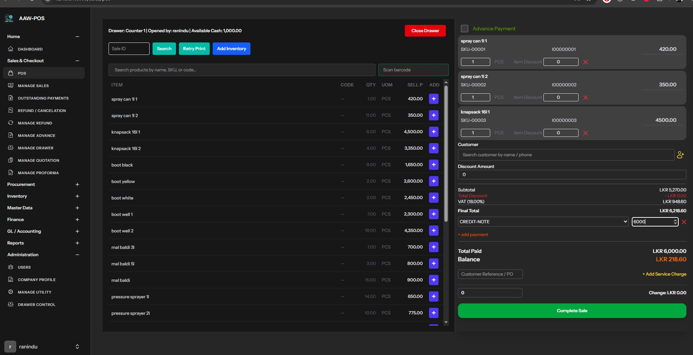
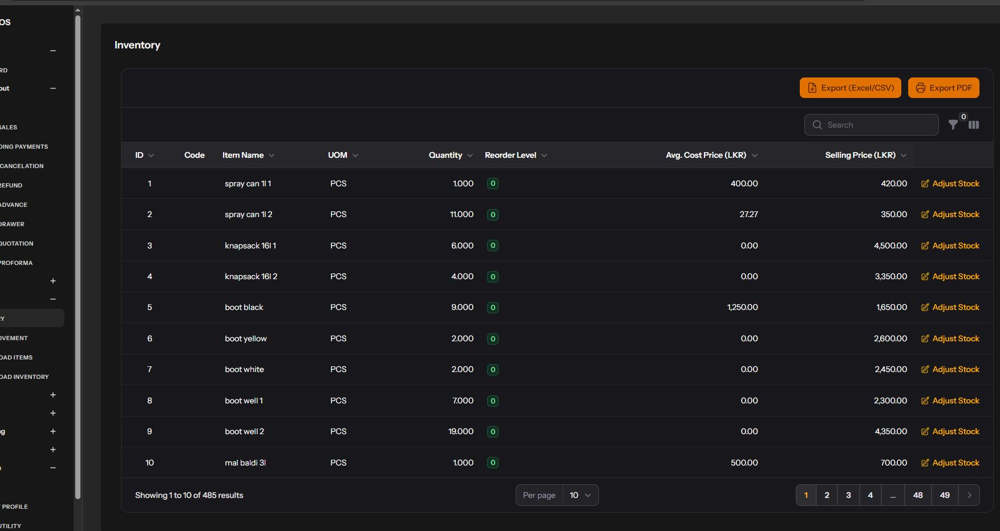
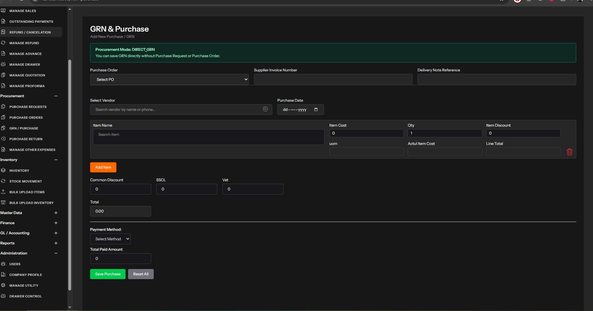
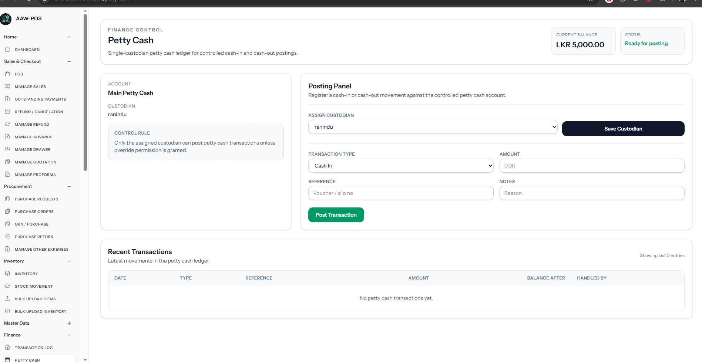
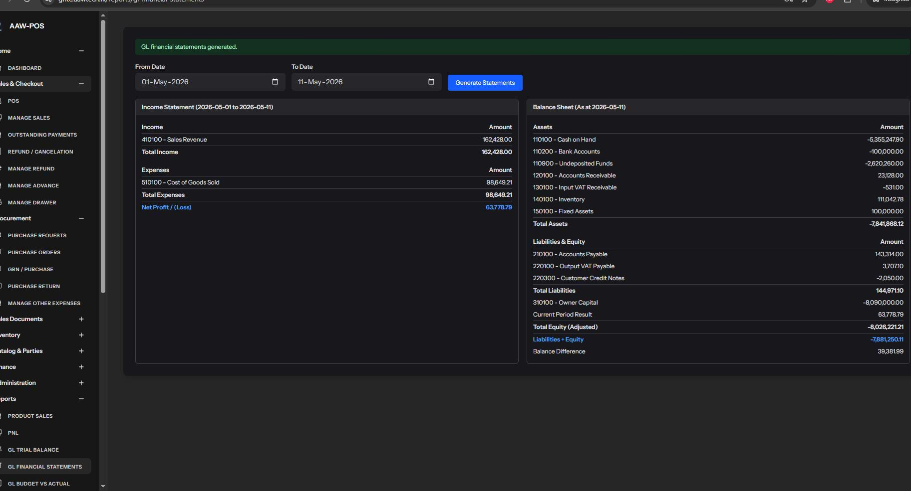
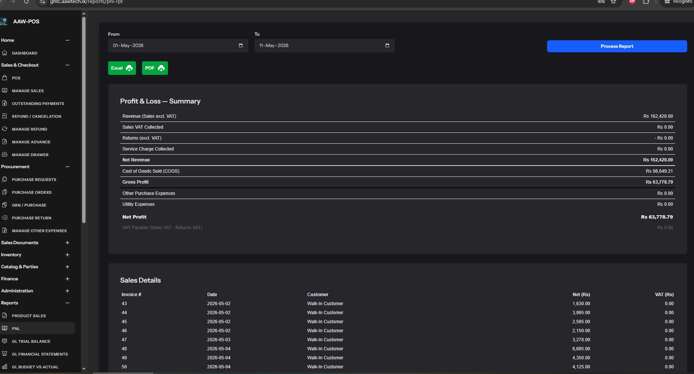

# Business Management System (Mini ERP) with POS

A modern, scalable Semi ERP with POS system leveraging the TALL stack for seamless retail & wholesale operations.

Built for businesses that need fast transactions, inventory control, procurement workflows, and integrated financial accounting.

## Description

This Business Management System (BMS) is designed for retail and wholesale businesses, offering a complete suite of tools for transaction processing, inventory control, procurement, and financial management. Built on Laravel 12 with Livewire components, it delivers a responsive, real-time experience without page reloads. The system supports multi-role access (Cashier, Manager, Accountant, Admin) and integrates dual-run accounting for operational efficiency and compliance. Key workflows include POS sales/refunds, purchase orders, inventory tracking, and GL posting, making it ideal for growing businesses needing robust, audit-ready operations.

## Features

### POS Operations

- Complete retail sales and refund handling
- Outstanding collections and customer advance tracking
- Multi-payment methods across cash, cards, credit, and mobile payments
- Multi POS accounts with multiple cash drawers
- Thermal receipt printing and PDF invoice generation
- Credit note creation for returns and adjustments

### Procurement & Supplier Management

- Purchase requests, purchase orders, and goods received notes (GRN)
- Return-to-supplier workflows
- Utility and other expense tracking
- Purchase-related expense management
- Vendor billing and supplier invoice control

### Inventory Control

- Stock movement tracking and item-level visibility
- Reorder alerts and inventory replenishment notifications
- Barcode printing and barcode-based scanning support
- Serial/batch tracking for applicable products
- Item tracking across sales, purchases, returns, and transfers

### Petty Cash & Expense Management

- Petty cash handling and cash expense tracking
- Expense categorization and reconciliation for small payments
- Cash drawer movement logging and audit-ready history

### Financial Integration

- General Ledger posting after transactional commit
- Trial balance, journal, and audit trail reports
- Credit note processing for customer returns or adjustments
- Reconciliation-ready accounting workflows
- Dual-run accounting model for stable operational and financial posting

### Documents & Sales Enablement

- Quotation management for customer proposals
- Proforma invoice handling for pre-order approvals
- Customer-facing document workflows for sales and approvals
- Document generation for quotes, invoices, receipts, and credit notes

### Reporting & Analytics

- Operational dashboards and analytics widgets
- Sales, inventory, procurement, and financial reports
- P&L and financial statement summaries
- Business insight views for managers and accountants

### User & Access Control

- Role-based access control (RBAC)
- Permission-driven module access for Cashier, Manager, Accountant, and Admin
- Secure access for sensitive finance and reporting areas

### Printing & Exports

- Thermal receipt printing for POS terminals
- PDF invoice and document generation
- Excel export support for reports and data extracts

## Core Functionality
The core revolves around transactional workflows: operational transactions (sales, purchases) are processed first, followed by automatic GL posting for accounting. This ensures business continuity even if accounting steps encounter issues. Modules include POS for front-end sales, back-office procurement for supply chain, inventory for stock oversight, and GL for financial reconciliation.

## Features Showcase
1. POS Sales Interface
Real-time sales processing with item scanning, discount application, and multi-payment methods.

3. Inventory Dashboard
Monitor stock levels, reorder points, and movement history with live updates.

5. Procurement Workflow
End-to-end purchase request to GRN process with approval modes and serial tracking.

7. Petty Cash handling
Petty Cash handling and management interface.

9. GL Finance Statement Report
View GL Finance Statement Report period-based filtering.

11. P & L Report
View  P & L Report with period-based filtering.

13. Multi-Role Dashboard
Role-specific widgets for stats, latest sales, and reorder alerts.

## Tech Stack

- Backend: PHP 8.2+, Laravel 12 Framework
- Frontend: Livewire 3 (with Flux/Volt), Alpine.js 3, Tailwind CSS 4
- Database: MySQL (via Laravel migrations)
- Admin Panel: Filament (forms, tables, widgets, actions)
- Additional Libraries:
-  DomPDF/MPDF for PDF generation
-  ESCPOS for thermal printing
-  Maatwebsite Excel for exports
-  Picqer PHP Barcode Generator
-  Spatie Laravel Permission for RBAC
-  Laravel Sanctum for API authentication
- Build Tools: Vite, Composer, NPM

## Architecture Diagram

[Presentation Layer]
    Livewire Components (UI/UX)
    Blade Templates

[Application Layer]
    Controllers (API/Export)
    Services (Business Logic: Invoice, Print, GL Posting)

[Domain/Data Layer]
    Eloquent Models
    Database Migrations

[Cross-Cutting]
    Authentication (Sanctum)
    Permissions (Spatie RBAC)
    GL Reconciliation & Idempotency

## Architecture Layers

1. Presentation Layer: Handles user interfaces with Livewire components and Blade views for dynamic, reactive interactions.
2. Application Layer: Manages business logic through controllers and services, including transaction processing and GL hooks.
3. Domain/Data Layer: Core data models and migrations for entities like sales, inventory, and GL accounts.
4. Cross-Cutting Concerns: Security (auth/permissions), reconciliation for accounting integrity, and idempotent posting to prevent duplicates.

## Tech Stack Highlights

- Laravel 12: Latest framework with enhanced performance and security features.
- TALL Stack: Tailwind for styling, Alpine.js for reactivity, Laravel for backend, Livewire for seamless SPA-like experience without JavaScript complexity.
- Filament: Modern admin panel for rapid UI development of forms, tables, and reports.
- Integrated Printing: Supports thermal and PDF outputs for receipts/invoices, crucial for retail environments.
- Scalable Permissions: Fine-grained RBAC ensures secure access across roles.
- Real-Time GL: Post-commit accounting integration allows operational-first workflows with automatic financial tracking.

## Privacy & Security Note
The system employs role-based access control (RBAC) via Spatie Laravel Permission, ensuring users only access authorized features. API endpoints are secured with Laravel Sanctum. GL operations include audit trails and reconciliation snapshots for financial integrity and compliance. All transactions are logged for traceability, and sensitive data is handled per Laravel's security best practices.

## Project Status
Production Ready - Currently in use for live retail operations with comprehensive testing guides and user manuals. Supports POS-first transactions with parallel GL posting, suitable for small to medium businesses expanding to semi-ERP capabilities. Future roadmap includes enhanced production and asset accounting.

